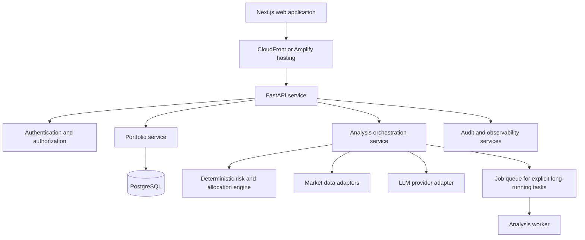

# Full Trading Research Application Plan

## Product Vision

Create a portfolio intelligence application that helps investors understand their positions, portfolio risk, diversification, and market context. A user can import or manually manage portfolio information, choose investment preferences, request analyses, explore research candidates, and keep a transparent history of every recommendation.

The product should be designed as an explainable decision-support and research tool. It should not execute trades or claim to provide regulated personalized investment advice unless the organization completes the applicable legal, compliance, licensing, security, and supervisory work.

## Guiding Principles

- On-demand by default: the user explicitly requests meaningful analysis.
- Evidence before narrative: calculations and sourced market facts come before LLM explanation.
- Explainability: every recommendation exposes inputs, assumptions, risks, data timestamp, and confidence.
- Bounded AI: the model works inside schemas, rules, and validated data.
- Provider independence: external market data and AI providers are replaceable adapters.
- Privacy by design: collect only data required for portfolio analysis.
- Incremental delivery: a useful local MVP comes before account aggregation, automation, or broad asset coverage.

## Product Versions

### Version 0: Local MVP

The local MVP is documented in `plan_mvp.md`.

- Single local user.
- Manual holdings and cash entry.
- US equities and ETFs only.
- Three basic risk profiles.
- One market-data provider.
- On-demand analysis.
- SQLite persistence.
- Next.js frontend and FastAPI backend.

### Version 1: Hosted Private Beta

- User accounts and secure authentication.
- PostgreSQL database.
- AWS deployment.
- Portfolio import from CSV.
- Better allocation, exposure, and analysis history.
- Email or in-app notification only for user-requested reports or explicit alerts.
- Audit logging, rate limiting, observability, and backup/recovery procedures.

### Version 2: Portfolio Intelligence

- Brokerage/account aggregation through a licensed and approved provider.
- Multiple portfolios, accounts, goals, and currencies.
- Richer asset coverage, subject to licensing and data availability.
- Research watchlists, scenario analysis, and comparison against selected benchmarks.
- More detailed source citations and report exports.
- User-configurable notification policies.

### Version 3: Regulated or Adviser-Integrated Features

Only pursue after legal and compliance review.

- Suitability workflows and detailed investor questionnaires.
- Adviser review and approval workflows.
- Compliance supervision and retention policies.
- Trade proposal export or broker integration.
- Tax-aware and retirement-account-specific analysis.

## Personas

### Self-directed investor

Needs a quick, understandable view of portfolio concentration and risk alignment. Wants analysis on demand, not another noisy market-alert product.

### Long-term investor

Needs periodic allocation reviews, diversification guidance, and simple explanations of how holdings fit a stated risk preference.

### Financial professional or adviser

Needs a reviewable client snapshot, visible assumptions, exportable reports, and an approval process before any client-facing recommendation. This is a later audience because it materially changes compliance requirements.

## Core User Journeys

### Build a portfolio

1. Create a portfolio and select a base currency.
2. Manually enter holdings, import a CSV, or later connect a brokerage account.
3. Review normalized symbols, positions, cost basis, and cash.
4. Save the portfolio.

### Define investor preferences

1. Choose a risk profile or complete an expanded preferences questionnaire in a later phase.
2. Select goals, investment horizon, liquidity preferences, and exclusions when supported.
3. Confirm the policy used for risk analysis.

### Request an analysis

1. Select a portfolio.
2. Click Analyze.
3. The application retrieves licensed, timestamped market data.
4. The rules engine calculates risk and allocation metrics.
5. The LLM turns validated facts into a structured research narrative.
6. The user reviews findings, limitations, recommendation rationale, and cited data.
7. The analysis becomes a versioned record.

### Review history

1. Browse prior analyses and their source-data timestamps.
2. Compare portfolio metrics at two points in time.
3. See which recommendations were accepted, dismissed, or still under review.

## Functional Capabilities

| Capability | MVP | Full app direction |
| --- | --- | --- |
| Portfolio entry | Manual holdings | Manual, CSV, brokerage import, reconciliation. |
| Assets | US equities and ETFs | Multi-market securities, funds, fixed income, and eventually other permitted assets. |
| Risk preferences | Three presets | Goals, horizon, liquidity, constraints, and configurable policies. |
| Data | Quotes and basic profiles | Fundamentals, corporate actions, benchmark data, macro data, approved news, and licensed analytics. |
| Analysis | Allocation and concentration | Scenario analysis, benchmark comparisons, drift, factor exposure, and tax-aware review where permitted. |
| AI | Structured explanation | Evidence-linked research workflows, summaries, Q&A, and human-review routing. |
| Reporting | In-app result | PDF/CSV export, scheduled reports only by explicit opt-in, and adviser review packs. |
| Accounts | None | Authentication, organizations, roles, and consent management. |

## System Architecture

### Service boundaries

- `portfolio-service`: portfolios, accounts, positions, transactions, imports, and reconciliation.
- `market-data-service`: symbol resolution, quotes, fundamentals, provider entitlement checks, normalization, caching, and timestamps.
- `analysis-service`: orchestration of deterministic calculations, source assembly, LLM calls, validation, and report persistence.
- `rules-engine`: profile policies, allocation calculations, risk scoring, eligibility checks, and recommendation constraints.
- `ai-service`: prompt construction, model routing, structured output validation, content safety, and provenance fields.
- `identity-service`: user accounts, organizations, roles, permissions, consent, and sessions.
- `reporting-service`: exports, report generation, notification preferences, and records retention.

Keep the first hosted release as a modular monolith where possible. Split services only when scaling, ownership, latency, or security boundaries justify it.

## AWS Deployment Path

### Initial hosted architecture

| Layer | AWS service options | Notes |
| --- | --- | --- |
| Frontend hosting | Amplify Hosting or S3 + CloudFront | Next.js support and CDN delivery. |
| Backend | ECS Fargate or AWS App Runner | Long-lived FastAPI API with simple deploy path. |
| Database | RDS PostgreSQL | Managed backups, encryption, and connection control. |
| Cache | ElastiCache Redis | Quote caching, rate limits, transient analysis state. |
| Files | S3 | Imported CSV files and generated reports with scoped access. |
| Secrets | Secrets Manager | Market-data and AI API credentials. |
| Identity | Cognito or an approved identity provider | Authentication, MFA, and account lifecycle. |
| Async work | SQS plus ECS/Lambda workers | Explicit report generation or longer analyses. |
| Scheduling | EventBridge | Opt-in reports and operational tasks; no implicit trading. |
| Observability | CloudWatch, X-Ray/OpenTelemetry | Logs, metrics, traces, alarms, and dashboards. |
| Security edge | WAF, CloudFront, ACM | TLS, rate limiting, common web protections. |

### Deployment stages

1. Local development: Docker Compose for frontend, backend, Postgres, and optional Redis.
2. Development AWS account: ephemeral environments from pull requests where cost permits.
3. Staging: production-like data-free environment with synthetic portfolios.
4. Production: separate AWS account, least-privilege roles, backups, alerting, and change controls.

Use infrastructure as code from the first cloud deployment. Terraform, AWS CDK, or Pulumi are all suitable; select one and keep cloud resources out of manual click-ops.

## Data Model Evolution

### Core entities

- `user`: identity reference, profile settings, agreement versions.
- `organization`: optional future tenant boundary for advisers or teams.
- `portfolio`: owner, name, base currency, risk policy, state.
- `account`: optional source account such as manual, CSV import, or authorized aggregator connection.
- `instrument`: canonical symbol, exchange, asset type, identifiers, metadata.
- `position`: current quantity, average cost, and valuation state.
- `transaction`: optional future buys, sells, dividends, transfers, and corrections.
- `market_snapshot`: licensed data points, provider metadata, timestamp, entitlement context.
- `analysis_run`: immutable analysis inputs, rules version, output, status, and timing.
- `recommendation`: action type, supporting evidence, status, user decision, and expiration.
- `audit_event`: security-sensitive or analysis-sensitive activity.

### Data design rules

- Use a canonical instrument identifier in addition to ticker symbols because symbols can be ambiguous or change.
- Retain exact data timestamps and provider metadata for every analysis.
- Version risk policies, prompts, calculation methods, and report templates.
- Store calculated values separately from raw vendor responses where licensing requires it.
- Use decimal arithmetic for monetary amounts and quantities.
- Encrypt sensitive data in transit and at rest.

## Market Data Strategy

### Provider abstraction

Define interfaces for quotes, instruments, fundamentals, market indicators, corporate actions, and news. Each vendor adapter maps data into internal models, applies entitlement checks, and records source metadata.

### Provider selection criteria

- Supported exchanges, asset types, and jurisdictions.
- Real-time, delayed, end-of-day, and historical licensing rights.
- Redistribution and display restrictions.
- Corporate actions, fundamentals, sector classification, and instrument identifiers.
- Rate limits, uptime, cost, and support.
- Legal terms for AI-assisted analysis and generated reporting.

### Data quality controls

- Normalize symbols and exchange identifiers before calling an external vendor.
- Detect stale, missing, inconsistent, or outlier prices.
- Maintain clear quote timestamps and market-session status.
- Never fill missing data with guessed values.
- Let analysis proceed in a reduced-confidence state when appropriate, or fail explicitly when critical data is absent.

## AI Design

### Role of AI

AI explains validated portfolio facts, highlights relevant conflicts or uncertainties, summarizes market context, and presents bounded research candidates. It should not calculate money values, invent price data, guarantee outcomes, execute transactions, or bypass deterministic suitability constraints.

### Input contract

Provide the model a compact, versioned object containing:

- Portfolio calculated metrics and exposure data.
- Policy/risk profile and the exact rules used.
- Data source, timestamps, and known gaps.
- Market context that is factual and provider-attributed.
- Eligible recommendation universe, if external candidates are supported.
- Strict content constraints and output schema.

### Output contract

Require JSON fields such as:

- `summary`
- `risk_alignment`
- `findings`
- `recommendations`
- `market_context`
- `assumptions`
- `limitations`
- `confidence`
- `source_references`
- `disclaimer`

Each recommendation needs an action category, scope, rationale, specific evidence identifiers, risks, uncertainty, and expiry criteria. The backend validates every field and rejects unsupported content.

### Guardrails

- Use allowlisted action verbs and categories.
- Require recommendation rationales to reference supplied facts.
- Block language that promises profit or certainty.
- Limit recommendation count and scope.
- Mark generated content distinctly from deterministic calculations.
- Add prompt-injection defenses for imported documents or news content.
- Log model name, prompt template version, input hash, response schema version, and validation outcome.
- Build evaluation datasets with synthetic portfolios and expected constraints before expanding model use.

## Risk and Recommendation Engine

### Deterministic layer

The rules engine calculates:

- Current value, allocation, gain/loss, and cash percentage.
- Single-position, sector, geography, market-cap, and asset-type concentration.
- Portfolio drift from target allocation.
- Risk-policy breaches.
- Liquidity and position-size constraints where data is available.
- Data-quality warnings.
- Basic scenario sensitivity and benchmark comparisons in later releases.

### Policy configuration

Risk profiles should be versioned configurations, not natural-language prompt instructions. A policy can define:

- Allowed asset classes.
- Allocation ranges.
- Maximum position and sector weights.
- Cash/liquidity floor.
- Volatility and drawdown tolerance proxies.
- Excluded sectors or instruments.
- Eligibility rules for research candidates.

Do not treat a simple risk preset as a complete suitability assessment.

## Security and Privacy

### Application security

- Enforce HTTPS, secure headers, CSRF protection where applicable, input validation, output encoding, and rate limits.
- Use server-side API calls for provider credentials. Never expose market-data or LLM keys to browser code.
- Enforce least privilege with IAM roles and short-lived credentials.
- Use dependency scanning, secret scanning, SAST, and regular patching.
- Require MFA for production administration.

### Data protection

- Minimize user information and define retention limits.
- Encrypt data at rest and in transit.
- Separate production, development, and test data.
- Use signed, time-limited object storage URLs for CSV imports and reports.
- Implement data export and deletion workflows according to applicable law.
- Do not use customer portfolios to train models unless explicit consent, contracts, and legal review allow it.

### Auditability

Log portfolio updates, import events, analysis requests, market-data versions, model metadata, recommendation status changes, access-control changes, and report exports. Audit logs should be append-only, access-controlled, and retained under a documented policy.

## Compliance and Legal Workstream

This is a separate delivery track, not a footer disclaimer.

- Obtain legal advice in each target jurisdiction before offering individualized recommendations.
- Determine whether the product is general research, a robo-adviser, an investment adviser tool, or another regulated service.
- Review marketing claims, onboarding language, risk-profile questions, disclosures, data-provider terms, record-retention rules, and user agreements.
- Establish escalation rules for prohibited assets, abnormal inputs, and user complaints.
- Implement clear disclosures for AI involvement, data freshness, limits, conflicts, and the absence of trading execution.
- Do not enable automated trading until the product has an approved regulatory, operational, and security design.

## User Experience Plan

### Primary screens

- Dashboard: portfolio cards, last analysis, data freshness, and attention-needed items.
- Portfolio workspace: holdings, valuations, allocation, exposure, editing, import, and analysis trigger.
- Analysis report: deterministic findings, AI narrative, recommendation table, evidence, risks, limitations, and history.
- Preferences: risk policy, goals, exclusions, currency, notification preferences, and data settings.
- Watchlist/research: saved research candidates and comparison views.
- Imports: CSV upload, column mapping, validation, preview, reconciliation, and error correction.
- Account/security: identity, sessions, consent, data export, and deletion controls.

### Design requirements

- Make data freshness, source, and uncertainty highly visible.
- Use tables for holdings and recommendations; do not hide key financial details behind decorative visualizations.
- Ensure user decisions are explicit: accept for review, dismiss, save to watchlist, or export. Do not make a recommendation execute anything.
- Support empty, loading, partial-data, stale-data, provider-failure, and model-failure states.
- Ensure responsive but dense workflows for repeat portfolio review.

## Delivery Roadmap

### Milestone A: Local MVP

Deliver the scope in `plan_mvp.md`.

Exit criteria:

- Manual portfolio and risk profile are saved locally.
- Analysis is on-demand and testable with provider mocks.
- Calculations are deterministic and AI output is schema-validated.
- Local startup documentation is complete.

### Milestone B: Production Foundation

1. Containerize frontend and backend.
2. Provision AWS infrastructure as code.
3. Migrate SQLite to PostgreSQL.
4. Add user identity, authorization, consent, and organization boundaries.
5. Implement secret management, CI/CD, observability, backups, and incident alerts.
6. Complete security and legal review for the beta scope.

Exit criteria:

- A private beta can safely support authenticated users.
- Production data has backups, monitoring, audit trails, and access controls.
- Provider and AI failures are observable and recoverable.

### Milestone C: Better Portfolio Intelligence

1. Add CSV import with a robust mapping and reconciliation workflow.
2. Add benchmark comparison, allocation drift, and richer exposures.
3. Add analysis comparisons and recommendation lifecycle states.
4. Expand market-data coverage according to licensed entitlements.
5. Add evidence links and report export.

Exit criteria:

- Users can understand changes over time and trace each finding to sourced data.

### Milestone D: Account Aggregation and Advanced Workflows

1. Select and integrate an approved aggregation provider.
2. Add account-linking consent and token lifecycle management.
3. Build sync, reconciliation, and error-resolution workflows.
4. Add user-configurable notifications with explicit opt-in.
5. Assess adviser workflows and approval features.

Exit criteria:

- Imported account positions are transparent, reconcilable, and never silently overwritten.

### Milestone E: Regulated Features, Only If Approved

1. Implement suitability, supervision, approval, and retention controls.
2. Add trade-proposal exports or integrations under approved operating procedures.
3. Expand compliance reporting and customer-support processes.

Exit criteria:

- Legal, compliance, security, operations, and product owners approve the launch requirements for each jurisdiction.

## Engineering Quality Plan

### Testing

- Unit tests for all financial calculations, allocations, rounding, and policy rules.
- Contract tests for every external data and AI provider adapter.
- API tests for authorization, validation, idempotency, error states, and data isolation.
- End-to-end tests for core portfolio and analysis flows.
- Visual and accessibility tests for key screens.
- Load tests for analysis requests and provider failure simulations.
- Model evaluation tests using synthetic portfolios and prohibited-output cases.

### Observability

Track:

- API latency and error rates.
- Market-data provider latency, freshness, quota consumption, and failures.
- AI request latency, model failures, schema-rejection rate, and cost.
- Analysis duration and status distribution.
- Import success, reconciliation conflict, and user-correction rates.
- Security events and privileged actions.

Do not log raw secrets or unredacted sensitive portfolio details into general application logs.

### CI/CD

On every pull request:

1. Run formatting, linting, type checking, unit tests, and dependency/security checks.
2. Build frontend and backend artifacts.
3. Run integration tests against mocked external services.
4. Publish a preview environment only after secret-scoping review.

On release:

1. Run migration checks and backups.
2. Deploy with health checks and rollback capability.
3. Run smoke tests.
4. Monitor error rates and provider health.

## Key Risks and Mitigations

| Risk | Mitigation |
| --- | --- |
| Incorrect or stale market data | Display timestamps, source data, validation warnings, and explicit failure states. |
| LLM hallucination | Deterministic inputs, strict JSON schema, backend validation, source references, and output limits. |
| Regulatory exposure | Scope as research/informational tool, obtain counsel, and gate regulated features. |
| API vendor lock-in | Use adapters, internal data contracts, and configuration-based provider selection. |
| Provider cost/rate limits | Cache responsibly, batch symbols, expose failures, and monitor quota. |
| Sensitive portfolio data | Data minimization, encryption, access control, consent, audit logs, and retention policy. |
| User over-reliance | Prominent uncertainty, explainable rules, disclaimers, and no automated execution. |
| Calculation errors | Decimal arithmetic, independent tests, versioned policies, and reviewable outputs. |

## Decisions Needed Before Expansion

1. Which country or jurisdictions will the product serve first?
2. Does "OpenCode API" identify a particular LLM host and model contract?
3. Which market-data vendor is approved for the first release and its intended display use?
4. Will the initial product be general research only, or will it ever offer personalized investment recommendations?
5. What asset universe, currencies, and markets are in scope for version one?
6. What is the organization policy for data retention, deletion, and model-provider data use?
7. Does the product require users, organizations, or adviser roles in the first hosted beta?
8. What exact risk-policy thresholds are approved, and who owns future changes?

## Success Measures

### Product

- A user can create a portfolio and receive a useful, traceable analysis in under a target response time.
- Users understand why recommendations are shown and what uncertainty applies.
- A meaningful share of analyses lead to a saved review decision, watchlist item, or portfolio update.

### Reliability

- High successful completion rate for portfolio import and manual-entry validation.
- Measurable market-data freshness and provider failure recovery.
- Low rate of malformed or rejected AI outputs after validation.

### Trust

- Every analysis shows source, time, rules version, and limitations.
- No unsupported performance guarantees or hidden autonomous behavior.
- Clear user controls for data, consent, and account connections.

## Definition of Done for the Full App

The full application is ready only when the selected release scope has:

- A documented and approved product and regulatory classification.
- Licensed market data used within its contractual permissions.
- Explainable, versioned, and independently tested calculations.
- AI outputs constrained by a tested contract and shown with limitations.
- Secure authentication, authorization, data encryption, secrets handling, audit logs, and incident procedures.
- Tested import and analysis workflows with clear failure recovery.
- Production observability, backup/restore, deployment rollback, and support ownership.
- Accessible user experience with clear data freshness and no automatic trade execution.
