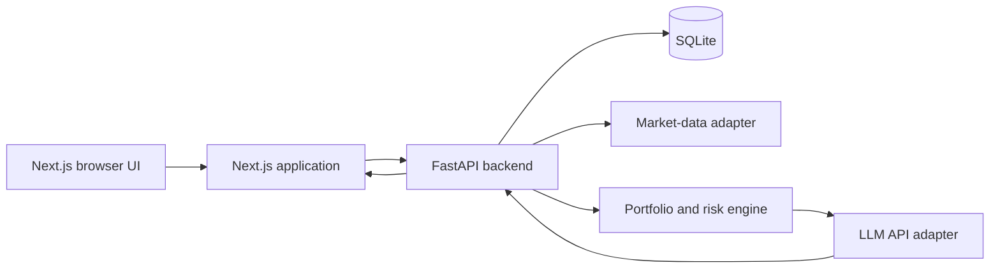

# Local Trading Research MVP Plan

## 1. Goal

Build a localhost-only web application that lets one person manually record an investment portfolio, select a risk profile, and request an on-demand analysis. The analysis combines deterministic portfolio checks, current market data, and an LLM response to produce understandable buy, reduce, hold, and research suggestions.

The MVP is an information and research tool. It must not place trades, connect to a brokerage, continuously monitor markets, or present itself as regulated personalized investment advice.

## 2. Product Decisions

### Recommended product shape

Use a rule-based portfolio engine with AI explanation.

- Python calculates allocation, concentration, cash position, unrealized return, and risk-rule breaches.
- A market-data adapter retrieves quotes and selected market context.
- The LLM receives validated facts and produces a structured explanation, possible actions, risks, and uncertainty.
- The backend validates the AI response before returning it to the frontend.

This avoids making an LLM the only source of financial recommendations and makes the system easier to test.

### User flow

1. The user creates a portfolio.
2. The user manually adds holdings with ticker, quantity, and average purchase price.
3. The user records cash available.
4. The user selects Conservative, Balanced, or Aggressive risk tolerance.
5. The user clicks Analyze portfolio.
6. The backend retrieves market data, calculates portfolio metrics, applies risk rules, and requests an AI explanation.
7. The frontend displays the portfolio summary, alerts, candidate actions, reasoning, and risks.
8. The analysis is saved locally so the user can compare results later.

## 3. MVP Scope

### Included

- A single local user with no login.
- Manual portfolio creation and editing.
- Equity and ETF tickers in one initial market, preferably US-listed securities.
- Holdings: symbol, quantity, average cost basis, and optional notes.
- Cash balance.
- Conservative, Balanced, and Aggressive risk profiles.
- Current or delayed quote retrieval through a replaceable market-data provider.
- Basic asset metadata such as company name, sector, and asset type when the provider supports it.
- Portfolio metrics and deterministic alerts.
- An on-demand AI analysis.
- Saved portfolios and analysis history in SQLite.
- Clear data timestamp, source name, limitations, and informational disclaimer.

### Excluded

- Brokerage accounts, account aggregation, or trading execution.
- Automatic or scheduled analysis.
- Real-time streaming prices.
- Multi-user accounts and authentication.
- Options, crypto, margin, derivatives, dividends, tax-lot accounting, or tax advice.
- Backtesting, price targets, guaranteed return claims, or autonomous decision-making.
- AWS deployment in the first implementation.

## 4. Technology Stack

| Area | MVP choice | Reason |
| --- | --- | --- |
| Frontend | Next.js, TypeScript, App Router | Good local development experience and clear route structure. |
| UI | Existing project style once selected; otherwise a small component set and CSS variables | Avoid unnecessary design-system complexity. |
| Backend | Python 3.12+ and FastAPI | Typed request models, automatic OpenAPI documentation, simple async HTTP. |
| Data models | Pydantic | Validate frontend requests, external data, and model output. |
| Database | SQLite with SQLAlchemy or SQLModel | No service dependency for localhost; portable migration path. |
| Market data | Provider adapter around Finnhub, Polygon.io, Twelve Data, or Alpha Vantage | Vendor can be changed without rewriting analysis logic. |
| AI | OpenCode-connected or OpenAI-compatible LLM API | The provider must support server-side API use and structured JSON output. |
| Tests | Pytest for backend, Vitest/Playwright for frontend | Separate fast logic checks from user-flow checks. |

## 5. Architecture



Keep the frontend separate from the backend. During local development, Next.js runs on one port and FastAPI on another; configure the API base URL through environment variables and CORS for localhost only.

## 6. Suggested Repository Layout

```text
brokenskytrading/
  frontend/
    app/
    components/
    lib/
    tests/
  backend/
    app/
      api/
      core/
      db/
      models/
      repositories/
      services/
        market_data/
        portfolio_analysis/
        ai/
      main.py
    tests/
  docs/
    plan_mvp.md
    plan_full_app.md
    theme_standard.md
  .env.example
  README.md
```

## 7. Data Model

### Portfolio

| Field | Type | Notes |
| --- | --- | --- |
| id | UUID or integer | Local primary key. |
| name | string | User-defined portfolio name. |
| risk_profile | enum | conservative, balanced, aggressive. |
| cash_balance | decimal | Cash held outside a security position. |
| created_at | datetime | Audit and history. |
| updated_at | datetime | Audit and history. |

### Holding

| Field | Type | Notes |
| --- | --- | --- |
| id | UUID or integer | Local primary key. |
| portfolio_id | foreign key | Owning portfolio. |
| symbol | string | Normalized exchange ticker. |
| quantity | decimal | Must be greater than zero. |
| average_cost | decimal | Average cost per unit. |
| notes | nullable string | Optional user context. |

### Analysis Snapshot

| Field | Type | Notes |
| --- | --- | --- |
| id | UUID or integer | Local primary key. |
| portfolio_id | foreign key | Portfolio analyzed. |
| created_at | datetime | When analysis ran. |
| data_as_of | datetime | Quote and market data timestamp. |
| market_provider | string | Provider used for auditability. |
| metrics_json | JSON | Deterministic calculated metrics. |
| recommendation_json | JSON | Validated AI result. |
| prompt_version | string | Supports future prompt changes. |

Use decimal values on the backend and in database storage. Do not use binary floating-point values for financial calculations.

## 8. Risk Profiles and Rules

The first release needs simple, explainable targets. Store them in a versioned backend configuration rather than embedding them in prompts.

| Rule | Conservative | Balanced | Aggressive |
| --- | --- | --- | --- |
| Maximum single holding | 10% | 15% | 25% |
| Maximum sector concentration | 25% | 35% | 45% |
| Minimum cash target | 10% | 5% | 0% |
| Preferred holdings count | 8+ | 6+ | 4+ |
| Volatility preference | Lower | Moderate | Higher tolerated |

These are product defaults, not universal financial rules. The UI should state the selected policy and allow policy changes only after the core MVP is stable.

Initial deterministic checks:

- Total portfolio value and cash percentage.
- Market value and unrealized profit/loss per holding.
- Weight of each holding.
- Sector and asset-type allocation where data is available.
- Largest holding and largest sector.
- Risk profile breaches.
- Missing or stale market data.
- A small market context, such as a broad-market ETF quote and volatility index availability, subject to provider licensing.

## 9. Market Data Integration

Create a `MarketDataProvider` interface before choosing a vendor-specific implementation.

```python
class MarketDataProvider(Protocol):
    async def get_quotes(self, symbols: list[str]) -> dict[str, Quote]: ...
    async def get_security_profiles(self, symbols: list[str]) -> dict[str, SecurityProfile]: ...
    async def get_market_context(self) -> MarketContext: ...
```

Initial provider selection criteria:

- Legal use for the intended application and display requirements.
- Supported US equities and ETFs.
- Quote freshness appropriate for an on-demand research app.
- Sector and asset metadata availability.
- Transparent free-tier and rate-limit behavior during development.
- A path to production licensing.

Cache quotes only for a short, documented period to control costs and prevent repeated calls. Always display the `data_as_of` timestamp.

## 10. AI Integration

"OpenCode API" needs to be confirmed before implementation. The backend should isolate it behind an `AIAnalysisProvider` interface so it can support OpenCode-connected models or an OpenAI-compatible endpoint without affecting the rest of the system.

The model receives only validated, normalized data:

- Portfolio weights and performance metrics.
- Selected risk profile and explicit risk rules.
- Market-data timestamp and provider.
- Minimal market context.
- Security metadata and relevant factual indicators.
- Instructions to avoid guarantees, fabricate facts, or tell users to execute trades.

The model must return strict JSON. Example contract:

```json
{
  "portfolio_summary": "Technology exposure is above the balanced-profile target.",
  "risk_alignment": "partially_aligned",
  "recommendations": [
    {
      "action": "reduce",
      "symbol": "EXAMPLE",
      "suggested_allocation_change_percent": -5,
      "reason": "This position exceeds the configured maximum allocation.",
      "risks": ["Reducing a position may realize a taxable gain."],
      "confidence": "medium"
    }
  ],
  "market_context": "Market information is current as of the supplied timestamp.",
  "limitations": ["This analysis is informational and may be incomplete."],
  "disclaimer": "Not investment, legal, or tax advice."
}
```

Backend validation requirements:

- Parse the model response with Pydantic.
- Reject unknown actions, missing ticker references, invalid percentages, and unsupported claims.
- Ensure suggested symbols are either held securities or explicitly marked as research candidates.
- Limit output size and recommendation count.
- Include an analysis status if market data or AI generation is incomplete.
- Store raw provider identifiers and validated result, but avoid storing API keys or unnecessary personal data.

## 11. API Endpoints

| Method | Path | Purpose |
| --- | --- | --- |
| `GET` | `/health` | Local service health check. |
| `GET` | `/portfolios` | List saved portfolios. |
| `POST` | `/portfolios` | Create a portfolio. |
| `GET` | `/portfolios/{id}` | Fetch a portfolio and its holdings. |
| `PUT` | `/portfolios/{id}` | Update name, cash, or risk profile. |
| `POST` | `/portfolios/{id}/holdings` | Add a holding. |
| `PUT` | `/holdings/{id}` | Update a holding. |
| `DELETE` | `/holdings/{id}` | Remove a holding. |
| `POST` | `/portfolios/{id}/analyze` | Fetch data and generate a new on-demand analysis. |
| `GET` | `/portfolios/{id}/analyses` | List analysis history. |
| `GET` | `/analyses/{id}` | Fetch a saved analysis. |

The analysis endpoint should return an accepted error state for invalid symbols, unavailable data, provider rate limits, or malformed model output. Do not silently fabricate a recommendation.

## 12. Frontend Screens

### Portfolio list

- Show saved portfolios, last analyzed timestamp, value when available, and risk profile.
- Provide a clear action to create a portfolio.

### Portfolio editor

- Name, cash balance, and risk-profile control.
- Holdings table with symbol, quantity, average cost, latest price, market value, allocation, and gain/loss.
- Explicit validation messages for invalid symbols and amounts.
- Primary Analyze portfolio command.

### Analysis view

- Data timestamp and source.
- Portfolio allocation and concentration summary.
- Risk-profile alignment status.
- Deterministic alerts before AI narrative.
- Recommendation table: action, security, proposed allocation adjustment, rationale, confidence, and risks.
- Market context and limitations.
- Clear informational disclaimer.
- Access to prior saved analyses.

Avoid charts until the data and calculation logic are correct. A simple allocation table or bar visualization is enough for version one.

## 13. Implementation Phases

### Phase 1: Foundation

1. Initialize `frontend` and `backend` applications.
2. Use SQLite as the only MVP database in local development, stored at `./trading_adviser.db` by default.
3. Add a small database configuration layer so the SQLite URL can be overridden by `DATABASE_URL` without changing application code.
4. Add local environment examples and README startup instructions.
5. Create a FastAPI health endpoint that verifies the API and SQLite connection, plus a Next.js connection test.
6. Configure the initial migration path, CORS, linting, formatting, and tests.

Acceptance: both applications start locally, and the frontend can call `/health`.

SQLite decision: the MVP intentionally has no external database service. SQLAlchemy will provide the persistence abstraction, and the schema will be managed through migrations before portfolio tables are introduced. PostgreSQL is deferred to the hosted private beta described in `plan_full_app.md`.

### Phase 2: Portfolio CRUD

1. Add portfolio, holding, and analysis database models.
2. Implement validated CRUD endpoints.
3. Build portfolio list and editor screens.
4. Add unit tests for decimal quantities, cost basis, and validation errors.

Acceptance: a user can create, edit, save, reload, and delete local portfolio holdings.

Current status: portfolio and holding SQLAlchemy models, SQLite table creation, validated CRUD API routes, the frontend portfolio editor, isolated in-memory SQLite CRUD tests, a local security catalog with autocomplete and validation, a cached yfinance-backed quote adapter, deterministic analysis preview, saved analysis history, a bounded local explanation provider, and portfolio-fit context are implemented. The quote adapter is explicitly local-only and replaceable.

### Phase 3: Market Data and Metrics

1. Implement the provider interface and one vendor adapter.
2. Normalize quote and profile data.
3. Calculate portfolio valuation, allocation, gain/loss, and exposure.
4. Add stale-data, invalid-symbol, and rate-limit handling.

Acceptance: a saved portfolio renders calculated values from provider data and fails transparently when data is unavailable.

### Phase 4: Risk Engine and AI Analysis

1. Add versioned risk-profile configurations.
2. Implement deterministic checks and test each rule.
3. Add the AI provider adapter and strict response schema.
4. Implement `POST /portfolios/{id}/analyze`.
5. Save snapshots and show result states in the UI.

Acceptance: analysis is user-triggered, traceable to its source data, schema-validated, and displays rules, reasoning, risks, and limitations.

### Phase 5: Polish and Release Readiness

1. Add loading, retry, empty, and error states.
2. Add analysis history and data-retention controls.
3. Verify responsive layouts and keyboard interaction.
4. Add a privacy notice, data-source attribution, and informational disclaimer.
5. Write local setup and provider-key documentation.

Acceptance: a new developer can run the app locally from the README and complete the primary user flow without manual database intervention.

## 14. Testing Strategy

### Backend

- Unit tests for financial calculations and risk rules.
- API tests for validation, CRUD, provider failures, and analysis result persistence.
- Contract tests with mocked market-data and AI provider responses.
- Tests that reject malformed or unsupported AI recommendations.

### Frontend

- Component tests for portfolio input validation and result states.
- End-to-end test for create portfolio -> add holdings -> analyze -> read results.
- Error-state tests for unavailable market data and AI failure.

### Manual checks

- Confirm values use decimals and round only for presentation.
- Confirm displayed quote timestamp matches returned data.
- Confirm the system never claims guaranteed returns or automatically executes a trade.
- Confirm API keys appear only in local environment variables and are never sent to the browser.

## 15. Local Configuration

Example environment variables:

```dotenv
MARKET_DATA_PROVIDER=finnhub
MARKET_DATA_API_KEY=
AI_API_BASE_URL=
AI_API_KEY=
AI_MODEL=
DATABASE_URL=sqlite:///./trading_adviser.db
NEXT_PUBLIC_API_BASE_URL=http://localhost:8000
```

Commit `.env.example`, but never commit `.env` files or provider keys.

## 16. Compliance, Privacy, and Safety Baseline

- Use language such as "research candidate," "consider reviewing," and "risk alert" rather than definitive trading instructions.
- Display a persistent disclaimer that the app is informational and not investment, tax, or legal advice.
- Attribute market data as required by the selected provider.
- Treat the risk profile as user-provided preference, not a regulatory suitability assessment.
- Do not market the feature as guaranteed, personalized, or autonomous financial advice without obtaining jurisdiction-specific legal and compliance review.
- Minimize stored personal data. For the MVP, the portfolio itself is the only sensitive user data retained locally.

## 17. Open Decisions Before Coding

1. Confirm whether "OpenCode API" means a specific hosted LLM endpoint, an OpenAI-compatible API, or another provider.
2. Pick the initial data provider and confirm its quote display and redistribution terms.
3. Confirm that the first market is US equities and ETFs only.
4. Decide whether current holdings are sufficient or transaction history is needed later.
5. Choose initial risk-rule thresholds and have them reviewed by the product owner.
6. Decide whether the analysis should suggest only changes to held assets or also external research candidates.

## 18. MVP Completion Checklist

- [ ] The project runs fully on localhost.
- [ ] A user can persist a manual portfolio in SQLite.
- [ ] The user can select and change a risk profile.
- [ ] The system fetches and timestamps market data through one provider adapter.
- [ ] The backend calculates portfolio metrics with deterministic tests.
- [ ] The user can trigger analysis manually.
- [ ] AI output is structured, validated, and accompanied by deterministic alerts.
- [ ] Analyses are saved and viewable later.
- [ ] Provider/API failures are visible and actionable.
- [ ] Documentation explains setup, limitations, data use, and disclaimers.

## 19. Current Build Status

- [x] Phase 1 project skeleton created.
- [x] SQLite is configured as the default local database.
- [x] Backend health endpoint checks SQLite connectivity.
- [x] Frontend health-check screen calls the backend.
- [ ] Add portfolio, holding, and analysis tables in Phase 2.
